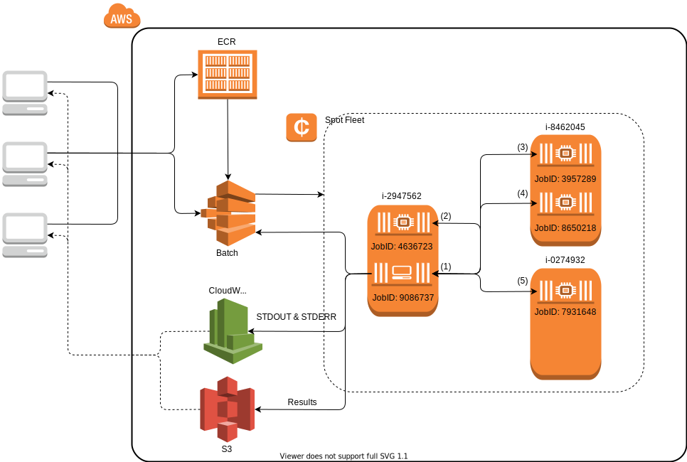

# AWSClusterManagers
[](https://doc.invenia.ca/invenia/AWSClusterManagers.jl/master)
[](https://doc.invenia.ca/invenia/AWSClusterManagers.jl/master)
[](https://gitlab.invenia.ca/invenia/AWSClusterManagers.jl/commits/master)
[](https://gitlab.invenia.ca/invenia/AWSClusterManagers.jl/commits/master)

Julia cluster managers which run within the AWS infrastructure.

## Installation

```julia
Pkg.add("AWSClusterManagers")
```

In order to run AWSClusterManagers you'll need to have the [AWS CLI](https://aws.amazon.com/cli)
installed. The recommended way to to install this is to use PIP which will have the latest
version available versus what may be available on your system's package manager.

```bash
pip install awscli
aws configure
```

Note that the AWS CLI need to be at least version 1.11.78 to work.


## Testing

Testing AWSClusterManagers can be performed on your local system using:

```julia
Pkg.test("AWSClusterManagers")
```

Adjustments can be made to the tests with the environmental variables `ONLINE` and
`AWS_STACKNAME`:

- `ONLINE`: Should contain a comma separated list which contain elements from the set
  "docker" and/or "batch".  Including "docker" will run the online Docker tests (requires
  [Docker](https://www.docker.com/community-edition) to be installed) and "batch" will run
  AWS Batch tests (see `AWS_STACKNAME` for details).
- `AWS_STACKNAME`: Switch the AWS Batch tests to use the stack specified instead of using
  the legacy "stack". If set, it is expected that the stack already exists in the current
  AWS profile. If unset, it is the legacy "stack" will be used which requires that the
  current AWS profile has access to legacy resources. Note that `AWS_STACKNAME` is only
  used if `ONLINE` contains "batch".

If you wish you can run the tests entirely inside of a Docker container which can be
generated from the included [Dockerfile](Dockerfile). You'll need to include the `-v`
option to be able to run the online Docker tests.

```bash
docker run --rm -e ONLINE=docker -v /var/run/docker.sock:/var/run/docker.sock <image>
```

### Online Docker tests

To run the online Docker tests you'll need to have [Docker](https://www.docker.com/community-edition)
installed. Additionally you'll also need access to pull down the image
"292522074875.dkr.ecr.us-east-1.amazonaws.com/julia-baked" using your current AWS profile.
If your current profile doesn't have access then ask `@sudo` in [#techsupport](https://invenia.slack.com/messages/C02A3K084/)
to "Please grant account ID <ACCOUNT_ID> permissions to the [`julia-baked`](https://console.aws.amazon.com/ecs/home?region=us-east-1#/repositories/julia-baked#permissions) repo".
Make sure to replace `<ACCOUNT_ID>` with the results of `aws sts get-caller-identity --query Account`.

### Online AWS Batch tests

To run the online AWS Batch tests you need all of the requirements as specified in [Online Docker tests](#online-docker-tests)
and one of the following:

- The current AWS profile uses the Invenia "legacy" account ID (292522074875)
- The current AWS profile has an aws-batch-manager-test stack running and `AWS_STACKNAME` is set

To make an aws-batch-manager-test compatible stack you can use the included CloudFormation
template [aws-batch-manager-test.yml](aws-batch-manager-test.yml). Alternatively you should
be able to use your own custom stack but it will be required to have at a minimum the named
outputs as shown in the the included template.


## Sample Project Architecture

The details of how the AWSECSManager & AWSBatchManager will be described in more detail shortly, but we'll briefly summarizes a real world application archtecture using the AWSBatchManager.



The client machines on the left (e.g., your laptop) begin by pushing a docker image to ECR, registering a job definition, and submitting a cluster manager batch job.
The cluster manager job (JobID: 9086737) begins executing `julia demo.jl` which immediately submits 4 more batch jobs (JobIDs: 4636723, 3957289, 8650218 and 7931648) to function as its workers.
The manager then waits for the worker jobs to become available and register themselves with the manager.
Once the workers are available the remainder of the script sees them as ordinary julia worker processes (identified by the integer pid values shown in parentheses).
Finally, the batch manager exits, releasing all batch resources, and writing all STDOUT & STDERR to CloudWatch logs for the clients to view or download and saving an program results to S3.
The clients may then choose to view or download the logs/results at a later time.
