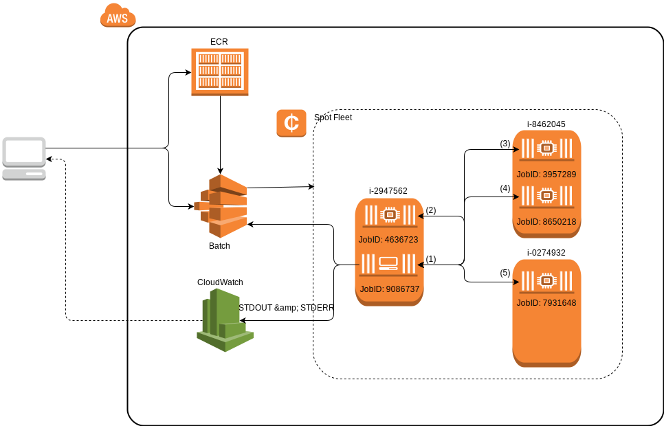
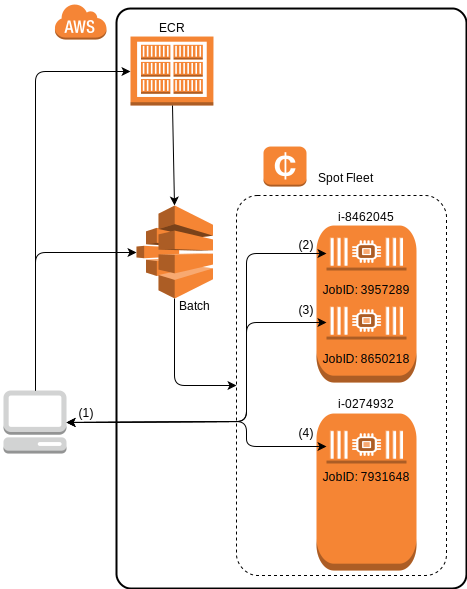

# Batch

The AWSBatchManager allows you to use the [AWS Batch](https://aws.amazon.com/batch/) service
as a Julia cluster.

## Requirements

* [AWS CLI](https://aws.amazon.com/cli) tools are installed and setup
* An IAM role is setup that allows `batch:SubmitJob` and `batch:DescribeJobs`
* A Docker image registered with [AWS ECR](https://aws.amazon.com/ecr/) which has Julia
  installed, AWSClusterManagers.jl, and the AWS CLI.

The AWSBatchManager requires that the running AWS Batch jobs are run using
["networkMode=host"](http://docs.aws.amazon.com/AmazonECS/latest/developerguide/task_definition_parameters.html#network_mode)
which is the default for AWS Batch. This is only mentioned for completeness.

## Usage

Let's assume we want to run the following script:

```julia
# demo.jl
import AWSClusterManagers: AWSBatchManager

addprocs(AWSBatchManager(4))

println("Num Procs: ", nprocs())

@everywhere id = myid()

for i in workers()
    println("Worker $i: ", remotecall_fetch(() -> id, i))
end
```

The workflow for deploying it on AWS Batch will be:

1. Build a docker container for your program.
2. Push the container to [ECR](https://aws.amazon.com/ecr/).
3. Register a new job definition which uses that container and specifies a command to run.
4. Submit a job to [Batch](https://aws.amazon.com/batch/).

### Overview



The client machines on the left (e.g., your laptop) begin by pushing a docker image to ECR, registering a job definition, and submitting a cluster manager batch job.
The cluster manager job (JobID: 9086737) begins executing `julia demo.jl` which immediately submits 4 more batch jobs (JobIDs: 4636723, 3957289, 8650218 and 7931648) to function as its workers.
The manager then waits for the worker jobs to become available and register themselves with the manager by executing `julia -e 'sock = connect(<manager_ip>, <manager_port>); Base.start_worker(sock, <cluster_cookie>)'` in identical containers.
Once the workers are available the remainder of the script sees them as ordinary julia worker processes (identified by the integer pid values shown in parentheses).
Finally, the batch manager exits, releasing all batch resources, and writing all STDOUT & STDERR to CloudWatch logs for the clients to view or download.

### Building the Docker Image

To begin we'll want to build a docker image which installs:
- `julia`
- `awscli`
- `AWSClusterManagers`
- `batch-print.jl`

Example)
```
# Dockerfile mostly copied from https://github.com/docker-library/julia/blob/master/Dockerfile

FROM debian:jessie

RUN apt-get update \
	&& apt-get install -y --no-install-recommends ca-certificates \
	&& rm -rf /var/lib/apt/lists/*

ENV JULIA_PATH /usr/local/julia
ENV JULIA_VERSION 0.5.2

RUN mkdir $JULIA_PATH \
	&& apt-get update && apt-get install -y curl \
	&& curl -sSL "https://julialang-s3.julialang.org/bin/linux/x64/${JULIA_VERSION%[.-]*}/julia-${JULIA_VERSION}-linux-x86_64.tar.gz" -o julia.tar.gz \
	&& curl -sSL "https://julialang-s3.julialang.org/bin/linux/x64/${JULIA_VERSION%[.-]*}/julia-${JULIA_VERSION}-linux-x86_64.tar.gz.asc" -o julia.tar.gz.asc \
	&& export GNUPGHOME="$(mktemp -d)" \
# http://julialang.org/juliareleases.asc
# Julia (Binary signing key) <buildbot@julialang.org>
	&& gpg --keyserver ha.pool.sks-keyservers.net --recv-keys 3673DF529D9049477F76B37566E3C7DC03D6E495 \
	&& gpg --batch --verify julia.tar.gz.asc julia.tar.gz \
	&& rm -r "$GNUPGHOME" julia.tar.gz.asc \
	&& tar -xzf julia.tar.gz -C $JULIA_PATH --strip-components 1 \
	&& rm -rf /var/lib/apt/lists/* julia.tar.gz*


ENV PATH $JULIA_PATH/bin:$PATH

RUN julia -e 'Pkg.init(); Pkg.add("AWSClusterManagers")'

COPY demo.jl demo.jl

CMD ["julia demo.jl"]
```

Now build the docker file with:
```bash
docker build -t 000000000000.dkr.ecr.us-east-1.amazonaws.com/demo:latest .
```

### Pushing to ECR

Now we want to get our docker image on ECR.
Start by logging into the ECR service (this assumes your have `awscli` configured with the correct permissions):
```
$(aws ecr get-login --region us-east-1)
```

Now you should be able to push the image to ECR:
```bash
docker push 000000000000.dkr.ecr.us-east-1.amazonaws.com/demo:latest
```

### Registering a Job Definition

Let's register a job definition now.

**NOTE**: Registering a batch job requires the ECR image (see above) and an [IAM role](http://docs.aws.amazon.com/IAM/latest/UserGuide/id_roles.html) to apply to the job.
The AWSBatchManager requires that the IAM role have access to the following operations:

- `batch:SubmitJob`
- `batch:DescribeJobs`

Example)
```bash
aws batch register-job-definition --job-definition-name aws-batch-demo --type container --container-properties '
{
    "image": "000000000000.dkr.ecr.us-east-1.amazonaws.com/demo:latest",
    "vcpus": 1,
    "memory": 1024,
    "jobRoleArn": "arn:aws:iam::000000000000:role/AWSBatchClusterManagerJobRole",
    "command": ["julia", "demo.jl"]
}'
```
**NOTE**: A job definition only needs to be registered once and can be
re-used for multiple job submissions.


### Submitting Jobs

Once the job definition has been registered we can then run the AWS Batch job.
In order to run a job you'll need to setup a compute environment with an associated a job queue:

```bash
aws batch submit-job --job-name aws-batch-demo --job-definition aws-batch-demo --job-queue aws-batch-queue
```

## Running AWSBatchManager Locally

While it is generally preferable to run the AWSBatchManager as a batch job, it can also be run locally.
In this case, worker batch jobs would be submitted from your local machine and would need to connect back to your machine from Amazon's network.
Unfortunately, this may result in networking bottlenecks if you're transferring large amounts of data between the manager (you local machine) and the workers (batch jobs).



As with the previous workflow, the client machine on the left begins by pushing a docker image to ECR (so the workers have access to the same code) and registers a job definition (if one doesn't already exist).
The client machine then runs `julia demo.jl` as the cluster manager which immediately submits 4 batch jobs (JobIDs: 4636723, 3957289, 8650218 and 7931648) to function as its workers.
The client machine waits for the worker machines to come online.
Once the workers are available the remainder of the script sees them as ordinary julia worker processes (identified by the integer pid values shown in parentheses) for the remainder of the program execution.

**NOTE**: Since the AWSBatchManager is not being run from within a batch job we need to give it some extra parameters when we create it.
```julia
mgr = AWSBatchManager(
    4,
    definition="aws-batch-worker",
    name="aws-batch-worker",
    queue="aws-batch-queue",
    region="us-west-1",
    timeout=5
)
```
