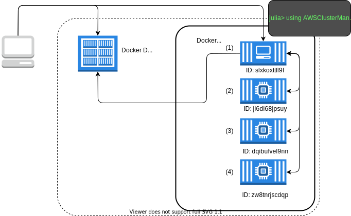

# Docker

The DockerManager allows you to simulate a multi-machine julia cluster using Docker containers.
In the future, worker containers could be run across multiple hosts using [docker swarm](https://docs.docker.com/engine/swarm/), but this is currently not a supported configuration.

## Requirements

* [Docker](https://docs.docker.com/engine/installation/)
* A Docker image which has Julia, Docker andAWSClusterManagers.jl installed. A sample Dockerfile is provided in the root directory of this repository.

## Usage

In order to build the AWSClusterManagers docker container you should first build the
julia-baked:0.5.1 docker image (or pull it down from ECR).
More details on getting the julia-baked:0.5.1 image can be found in our [Dockerfiles repository](https://gitlab.invenia.ca/invenia/Dockerfiles/tree/master/julia-baked).

```bash
docker build -t aws-cluster-managers-test:latest .

# Optionally tag and push the image to ECR to share with others or for use with the AWSBatchManager.
$(aws ecr get-login --region us-east-1)
docker tag aws-cluster-managers-test:latest 292522074875.dkr.ecr.us-east-1.amazonaws.com/aws-cluster-managers-test:latest
docker push 292522074875.dkr.ecr.us-east-1.amazonaws.com/aws-cluster-managers-test:latest
```

## Overview



The client machine on the left (e.g., you laptop) begins by starting an interactive docker container using
the image "myproject".
```bash
docker run --network=host -v /var/run/docker.sock:/var/run/docker.sock --rm -it myproject:latest julia
                _
    _       _ _(_)_     |  A fresh approach to technical computing
   (_)     | (_) (_)    |  Documentation: http://docs.julialang.org
    _ _   _| |_  __ _   |  Type "?help" for help.
   | | | | | | |/ _` |  |
   | | |_| | | | (_| |  |  Version 0.5.1 (2017-03-05 13:25 UTC)
 _/  |\__'_|_|_|\__'_|  |
|__/                    |  x86_64-amazon-linux

julia>
```
**NOTE**: We need to use `--network=host -v /var/run/docker.sock:/var/run/docker.sock` in order for the docker container to bring up worker containers.

From here we can bring up worker machines and debug our multi-machine julia code.
```julia
julia> import AWSClusterManagers: DockerManager

julia> addprocs(DockerManager(4, "myproject:latest"))
4-element Array{Int64,1}:
 2
 3
 4
 5

julia> nprocs()
5

julia> for i in workers()
           println("Worker $i: ", remotecall_fetch(() -> myid(), i))
       end
Worker 2: 2
Worker 3: 3
Worker 4: 4
Worker 5: 5
```

## Running the DockerManager outside of a container

It's also possible to run the DockerManager outside of a container, so long as the host docker daemon is running and you're running the same version of julia (and packages) on the host.
